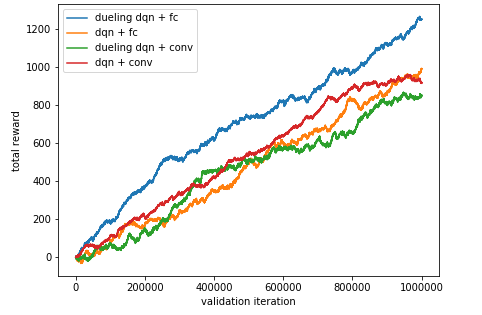

# Stocks Trading System with Reinforcement Learning
## Introduction
This repo contains all the code for the project of TAMU CSCE689 Reinforcement Learning Course. We implement a simple stocks trading system with deep Q-learning algorithm.
## Run
To reproduce the results, run the code in jupyter notebook file run.ipynb.
## Results

## Acknowledge
We particularly appreciate Shmuma for that he creates a gym-like stocks trading environment and makes it publicly available at [GitHub](https://github.com/PacktPublishing/Deep-Reinforcement-Learning-Hands-On-Second-Edition/blob/master/Chapter10/lib/environ.py). We used his implemented environment in our project.